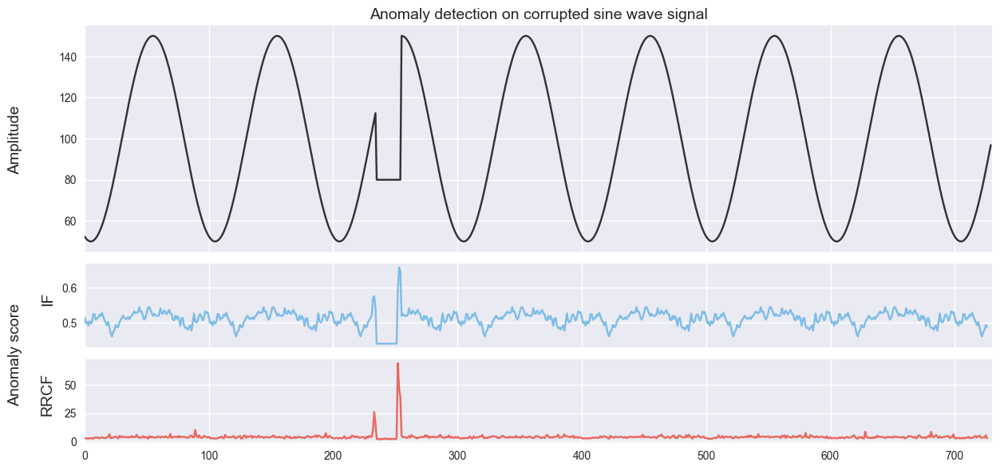

# Summary

In this paper, we present the first open-source implementation of the *robust
random cut forest* (RRCF) algorithm--an unsupervised ensemble method for anomaly
detection on streaming data [@guha_2016_robust]. RRCF offers a number of features that many
competing anomaly detection algorithms lack. Specifically, RRCF:

- Is designed to handle large volumes of streaming data.
- Is well-suited to data of high dimension.
- Reduces the influence of irrelevant dimensions in the input data.
- Gracefully handles duplicates and near-duplicates that could otherwise mask
  the presence of outliers.
- Features an anomaly-scoring metric with a clear underlying statistical meaning.

The RRCF algorithm is currently used for anomaly detection in the *Amazon Kinesis*
real-time analytics engine. The goal of our repository is to provide an open-source
implementation of the RRCF algorithm and its core data structures for the
purposes of facilitating experimentation and enabling future extensions.

# Background

Anomaly detection is an important unsupervised learning problem with economic
and social implications in a variety of fields. In finance, online anomaly
detection algorithms are used to alert customers to potentially fraudulent
credit card transactions [@aleskerov_1997_cardwatch, @liu_2012_isolation]. In web
infrastructure, anomaly detection algorithms facilitate improved intrusion
detection [@lazarevic_2003_comparative], and can be used to flag and deflect malicious IPs
during distributed denial of service (DDoS) attacks [@mirkovic_2004_taxonomy]. With
respect to monitoring of industrial and infrastructure control systems, outlier
monitoring can be used to identify malfunctioning industrial equipment, flag
quality assurance problems, and alert supervisors to hazardous conditions
[@filev_2010_industrial]. These application areas demand powerful but flexible approaches
that can process large volumes of streaming data while at the same time adapting
to non-stationary conditions.

Existing anomaly detection approaches typically suffer from a few key
 limitations that hinder their usefulness in real-time applications. First, many
 conventional methods are not suited for streaming data [@guha_2016_robust].
 Methods such as isolation forest [@liu_2012_isolation] and local outlier factor
 detection [@breunig_2000_lof] must reconstruct the entire model when a new data
 point is added, while methods such as replicator neural networks and one-class
 support vector machines must be retrained if the distribution of the input data
 changes over time. Second, many existing algorithms fail to detect anomalies in
 the presence of duplicates or near-duplicates--a phenomenon known as "outlier
 masking" [@guha_2016_robust]. Finally, existing algorithms often struggle to
 detect outliers in high-dimensional data, especially in the presence of
 "irrelevant dimensions" that offer little relevant information to the outlier
 detection problem [@guha_2016_robust]. The *robust random cut forest* algorithm
 addresses these problems by using a novel sketching algorithm to construct a
 real-time summary of the data [@guha_2016_robust]. This sketching algorithm works
 by (i) constructing an ensemble of space-partitioning binary trees on the point
 set, and then (ii) generating an anomaly score based on the conditional change
 in model complexity imposed by the insertion or deletion of each point. This
 method efficiently detects anomalies on streaming data while at the same time
 adapting to changing input signals and handling "collusive" outliers.

# Example applications

## Test 1: Detection in the presence of collusive outliers and irrelevant dimensions

Here, we validate a test case from the original RRCF paper involving two dense
clusters of 3-dimensional points in which almost all the variation occurs in the
first dimension. Consider two clusters consisting of 1000 points each
distributed according to $x_i \sim \mathcal{N}([5 \ 0 \ 0]^T, 0.01 \cdot I)$ for
the first class and $x_i \sim \mathcal{N}([-5 \ 0 \ 0]^T, 0.01 \cdot I)$ for the
second class. Add to this point set 10 collusive outlier points distributed
according to $x_i \sim \mathcal{N}([0 \ 0 \ 0]^T, 0.01 \cdot I)$. The goal of
this test case is to detect the 10 collusive outlier points in the center. From
Figure 1, it can be seen that RRCF successfully detects the outliers, while
One-Class SVM and Isolation Forest do not.

## Test 2: Detection of event onset

We validate another result from the original paper by showing that RRCF can
effectively detect both the onset and offset of anomalies on streaming time
series data. As in the original paper, we generate a sine wave from time $t \in
[0, 730]$, with period $T = \pi / 50$ and a phase offset of $\phi = 30$. An
anomaly is then injected into the sine wave along the interval $t \in [235,
255]$. Using a technique recommended by the original paper, we sample the data
using a "shingling" approach. In this approach, a window of length $\ell$ is
passed over the data, and each consecutive windowed sequence is treated as an
$\ell-$dimensional point (e.g. for a shingle of length 4, the sampled point at
time $t$ will be $[x_{t-3}, \ x_{t-2}, \ x_{t-1}, \ x_t]^T$). We apply both
Isolation Forest and RRCF with a forest size of 100 trees, and a tree size of
256 points. From Figure 2, it can be seen that RRCF better detects the onset of
the anomaly.

# Acknowledgements

We thank Dr. Alfred Hero for bringing the RRCF algorithm to our attention, and Dr. Branko
Kerkez for his invaluable support.

# References
